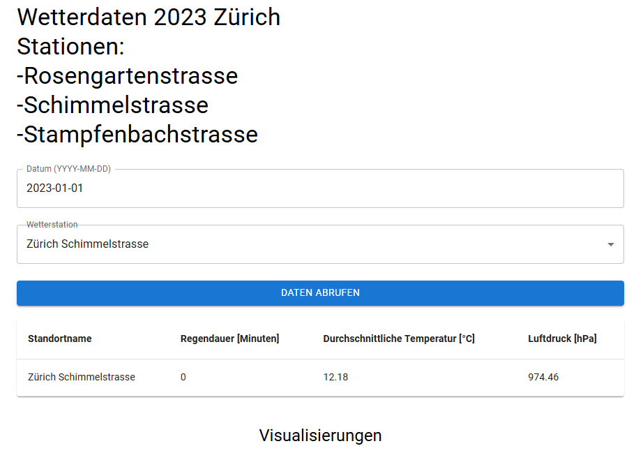
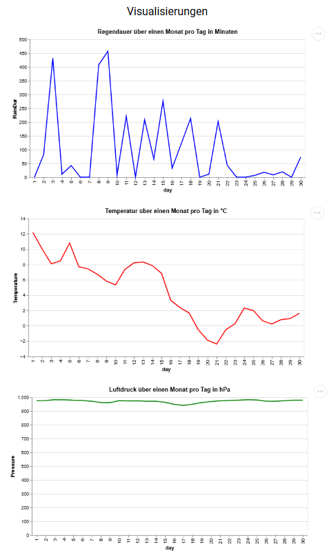

# WebApp mit eigener Lokalen API (Wetterdaten)

Mithilfe der WebApp können Wetterdaten vom Jahr 2023 in Zürich visualisiert werden.

## Getting Started

1. Repository klonen:

   ```
   git clone
   ```

   Alternativ kann auch mithilfe des Github-Desktop das Repository geklont werden

2. benötigte Programme:

   - node.js
   - anaconda
   - VSCode

### API

1. Erstellung eines Anaconda-Enviorment (falls nicht schon vorhanden)

   ```
   conda create -n webapi python=3.12 -c conda-forge
   ```

2. Installation der benötigten Module:

   ```
   pip install fastapi[standard]
   ```

   ```
   pip install pyproj
   ```

3. API-Server starten:

   In der anaconda-Promt mit Enviorment aktivieren und zum Odner der API (Unterordner "api") navigieren

   ```
   conda activate webapi
   ```

   zum Pfad der Dateien navigieren

   ```
   cd "Pfad bis und mit Ordner api"
   ```

   Server starten

   ```
   fastapi dev api.py
   ```

   Anaconda-Prompt offen lassen

### Frontend-Server

1. Im Terminal im VS-Code Module installieren:

   ```
   npm install
   oder yarn
   ```

2. Webserver starten

   ```
   npm run dev
   oder yarn dev
   ```

3. Auf den angezeigten localhost-Link klicken und die Webseite öffnen

## Beispielbilder der WebApp




